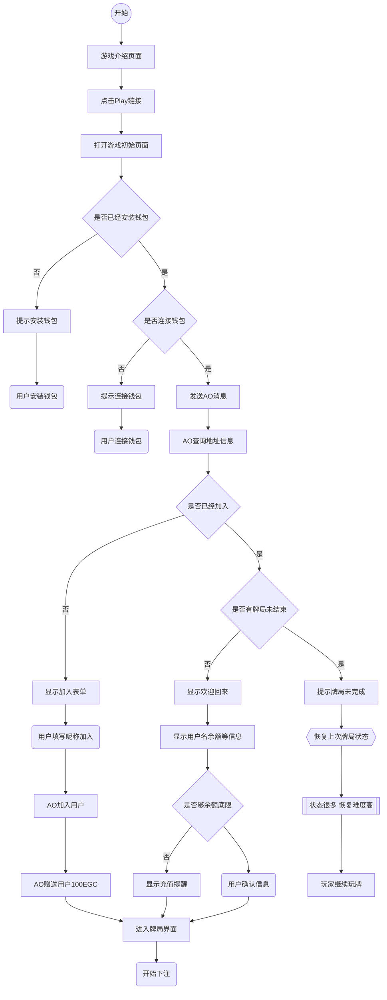

```mermaid
flowchart TD
    A((开始)) 
    --> 游戏介绍页面
    --> 点击Play链接
    --> 打开游戏初始页面
    -->WalletInstalled{是否已经安装钱包}
    --否-->提示安装钱包
    -->UserInstall(用户安装钱包)
    
    WalletInstalled--是-->Connected{是否连接钱包}
    --否-->提示连接钱包
    -->UserConnect(用户连接钱包)

    Connected--是-->发送AO消息
    -->AO查询地址信息
    -->Joined{是否已经加入}
    --否-->显示加入表单
    -->EterrName(用户填写昵称加入)
    -->AO加入用户
    -->AO赠送用户100EGC
    -->进入牌局界面

    Joined--是-->StateExist{是否有牌局未结束}
    --否-->显示欢迎回来
    -->显示用户名余额等信息
    -->Balance{是否够余额底限}
    --否-->显示充值提醒
    -->进入牌局界面
    Balance
    -->OK(用户确认信息)
    -->进入牌局界面
    -->Begin(开始下注)
    
    StateExist--是-->提示牌局未完成
    -->Restore{{恢复上次牌局状态}}
    -->Hard[[状态很多 恢复难度高]]

    -->玩家继续玩牌          
    

```
