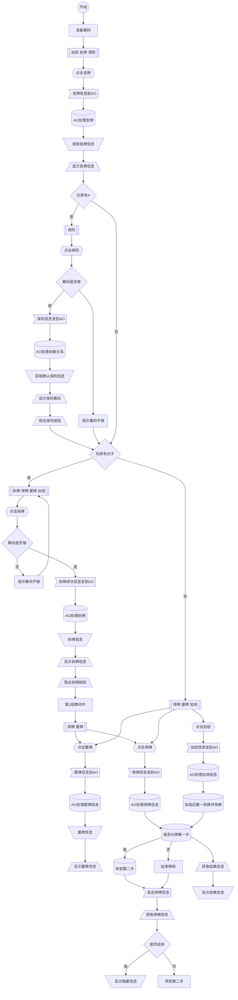

```mermaid
flowchart TD
    A((开始)) 
    --> 准备筹码
    --> DoubleDealClear[[加倍 发牌 清除]]
    --> PlayerclickDeal{{点击发牌}}
    --> ActionDeal>发牌信息到AO]
    --> AODeal[(AO处理发牌)]
    --> GetDeal[\获取发牌信息/]
    --> DisplayDeal[/显示发牌信息\]
    --> IfA{庄家有A}--是-->Isu[[保险]]
    -->ConfirmIsu{{点击保险}}   
    -->IsuBalance{筹码是否够}
    --是-->ActionIsu>保险信息发到AO]
    -->AOIsu[(AO处理余额关系)]
    -->GetIsu[\获取确认保险信息/]
    -->DisIsu[/显示保险筹码\]
    -->HideIsu[/隐去保险按钮\]

    -->IfPair{玩家有对子}--是
    -->CanSplit[[拆牌 停牌 要牌 加倍]]   

    CanSplit
    -->ConfirmSplit{{点击拆牌}}  
    -->SplitBalance{筹码是否够}
    --否-->CanNotSplit(提示筹码不够)
    CanNotSplit-->CanSplit

    SplitBalance--是-->ActionSplit>拆牌成功信息发到AO]
    -->AOSplit[(AO处理拆牌)]
    -->GetSplit[\拆牌信息/]
    -->DisplaySplit[/显示拆牌信息\]
    -->NoSplit[/隐去拆牌按钮\]
    -->第1组牌动作
    -->StandHit[[停牌 要牌]]
    -->ClickHit{{点击要牌}}
    -->ActionHit>要牌信息到AO]
    -->AOHit[(AO处理要牌信息)]
    -->GetHit[\要牌信息/]
    -->DisHit[/显示要牌信息\]

    IsuBalance-->noIsu(提示筹码不够)-->IfPair


    IfA--否-->IfPair
    --否-->    
    HitAction[[停牌 要牌 加倍]]

    StandHit-->ClickStand{{点击停牌}}
    -->ActionStand>停牌信息发到AO]
    -->AOStand[(AO处理停牌信息)]
    -->AONext[(是否分牌第一手)]
    --是-->index[(转到第二手)]
    -->End    
    AONext--否-->结束牌局
    -->End>发送停牌信息]
    -->GetStand[/获取停牌信息\]
    -->IfEnd{是否结束}
    --是-->DisStand[\显示输赢信息/]

    IfEnd--否-->转到第二手
    
    HitAction-->ClickHit{{点击要牌}}

    HitAction-->ClickStand

    HitAction-->ClickDouble{{点击加倍}}
    -->DoubleToAO>加倍信息发到AO]
    -->AODouble[(AO处理加倍信息)]
    -->AODouble2[(加倍后要一张牌并停牌)]
    -->AONext
    -->GetDouble[/获取结果信息\]
    -->DisDouble[\显示结果信息/]


    

```
